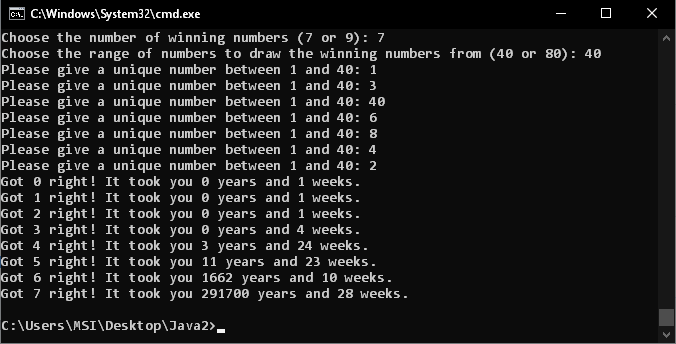

# LotteryCalculator

A Java program that calculates the time it would take to win the lottery. The user inputs a set of numbers, which are compared to random sets of lottery numbers until the user wins. Each lottery entry takes one week.

The user can choose either 7 or 9 winning numbers, and the number range of either 40 or 80.

